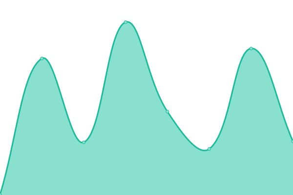
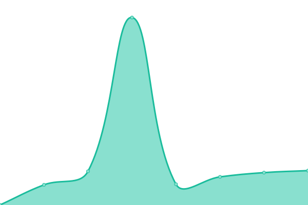

# [📈 Live Status](https://status.cachyos.org): <!--live status--> **🟧 Partial outage**

This repository contains the open-source uptime monitor and status page for [CachyOS](https://cachyos.org), powered by [Upptime](https://github.com/upptime/upptime).

With [Upptime](https://upptime.js.org), you can get your own unlimited and free uptime monitor and status page, powered entirely by a GitHub repository. We use [Issues](https://github.com/CachyOS/statuspage/issues) as incident reports, [Actions](https://github.com/CachyOS/statuspage/actions) as uptime monitors, and [Pages](https://status.cachyos.org) for the status page.

<!--start: status pages-->
<!-- This summary is generated by Upptime (https://github.com/upptime/upptime) -->
<!-- Do not edit this manually, your changes will be overwritten -->
<!-- prettier-ignore -->
| URL | Status | History | Response Time | Uptime |
| --- | ------ | ------- | ------------- | ------ |
|  [Website](https://cachyos.org/) | 🟩 Up | [website.yml](https://github.com/CachyOS/statuspage/commits/HEAD/history/website.yml) | 

 488ms
     
 | 

<a href="https://status.cachyos.org/history/website">100.00%</a>
    

|  [Wiki](https://wiki.cachyos.org/) | 🟩 Up | [wiki.yml](https://github.com/CachyOS/statuspage/commits/HEAD/history/wiki.yml) | 

 158ms
     
 | 

<a href="https://status.cachyos.org/history/wiki">100.00%</a>
    

|  [Discuss](https://discuss.cachyos.org/) | 🟩 Up | [discuss.yml](https://github.com/CachyOS/statuspage/commits/HEAD/history/discuss.yml) | 

 378ms
     
 | 

<a href="https://status.cachyos.org/history/discuss">100.00%</a>
    

|  [CDN77 CDN (Worldwide)](https://cdn77.cachyos.org/repo/x86_64/cachyos/cachyos.db) | 🟩 Up | [cdn-77-cdn-worldwide.yml](https://github.com/CachyOS/statuspage/commits/HEAD/history/cdn-77-cdn-worldwide.yml) | 

 492ms
     
 | 

<a href="https://status.cachyos.org/history/cdn-77-cdn-worldwide">100.00%</a>
    

|  [USA Mirror](https://us.cachyos.org/) | 🟩 Up | [usa-mirror.yml](https://github.com/CachyOS/statuspage/commits/HEAD/history/usa-mirror.yml) | 

 98ms
     
 | 

<a href="https://status.cachyos.org/history/usa-mirror">100.00%</a>
    

|  [USA Mirror (Minnesota)](https://us-mnz.soulharsh007.dev/cachyos/) | 🟩 Up | [usa-mirror-minnesota.yml](https://github.com/CachyOS/statuspage/commits/HEAD/history/usa-mirror-minnesota.yml) | 

 285ms
     
 | 

<a href="https://status.cachyos.org/history/usa-mirror-minnesota">100.00%</a>
    

|  [USA Mirror (Michigan)](https://mirrors.lansing2600.org/cachyos/) | 🟩 Up | [usa-mirror-michigan.yml](https://github.com/CachyOS/statuspage/commits/HEAD/history/usa-mirror-michigan.yml) | 

 214ms
     
 | 

<a href="https://status.cachyos.org/history/usa-mirror-michigan">100.00%</a>
    

|  [USA CDN (Michigan)](https://cdn.lansing2600.org/cachyos/) | 🟩 Up | [usa-cdn-michigan.yml](https://github.com/CachyOS/statuspage/commits/HEAD/history/usa-cdn-michigan.yml) | 

 262ms
     
 | 

<a href="https://status.cachyos.org/history/usa-cdn-michigan">100.00%</a>
    

|  [Canada Mirror](https://ca.mirror.cx/cachyos/) | 🟩 Up | [canada-mirror.yml](https://github.com/CachyOS/statuspage/commits/HEAD/history/canada-mirror.yml) | 

 788ms
     
 | 

<a href="https://status.cachyos.org/history/canada-mirror">100.00%</a>
    

|  [Canada Mirror (Quebec)](https://mirror.allthingslinux.org/cachyos/) | 🟥 Down | [canada-mirror-quebec.yml](https://github.com/CachyOS/statuspage/commits/HEAD/history/canada-mirror-quebec.yml) | 

 0ms
     
 | 

<a href="https://status.cachyos.org/history/canada-mirror-quebec">0.00%</a>
    

|  [France Mirror](https://mirror.lesviallon.fr/cachy/) | 🟩 Up | [france-mirror.yml](https://github.com/CachyOS/statuspage/commits/HEAD/history/france-mirror.yml) | 

 622ms
     
 | 

<a href="https://status.cachyos.org/history/france-mirror">100.00%</a>
    

|  [Austria Mirror](https://at.cachyos.org) | 🟩 Up | [austria-mirror.yml](https://github.com/CachyOS/statuspage/commits/HEAD/history/austria-mirror.yml) | 

 680ms
     
 | 

<a href="https://status.cachyos.org/history/austria-mirror">100.00%</a>
    

|  [Germany Mirror](https://mirror.mergedcloud.de/cachyos/) | 🟩 Up | [germany-mirror.yml](https://github.com/CachyOS/statuspage/commits/HEAD/history/germany-mirror.yml) | 

 737ms
     
 | 

<a href="https://status.cachyos.org/history/germany-mirror">100.00%</a>
    

|  [Netherlands Mirror](https://nl.mirror.cx/cachyos/) | 🟩 Up | [netherlands-mirror.yml](https://github.com/CachyOS/statuspage/commits/HEAD/history/netherlands-mirror.yml) | 

 567ms
     
 | 

<a href="https://status.cachyos.org/history/netherlands-mirror">100.00%</a>
    

|  [Sweden Mirror](https://mirror.zyner.org/mirror/cachyos/) | 🟩 Up | [sweden-mirror.yml](https://github.com/CachyOS/statuspage/commits/HEAD/history/sweden-mirror.yml) | 

 534ms
     
 | 

<a href="https://status.cachyos.org/history/sweden-mirror">100.00%</a>
    

|  [Switzerland Mirror](https://mirror.hb9hil.org/cachyos/) | 🟩 Up | [switzerland-mirror.yml](https://github.com/CachyOS/statuspage/commits/HEAD/history/switzerland-mirror.yml) | 

 836ms
     
 | 

<a href="https://status.cachyos.org/history/switzerland-mirror">100.00%</a>
    

|  [Norway Mirror](https://no.mirror.cx/cachyos/) | 🟩 Up | [norway-mirror.yml](https://github.com/CachyOS/statuspage/commits/HEAD/history/norway-mirror.yml) | 

 784ms
     
 | 

<a href="https://status.cachyos.org/history/norway-mirror">100.00%</a>
    

|  [Italy Mirror (NextWorks)](https://cachyos.next-works.it/) | 🟩 Up | [italy-mirror-next-works.yml](https://github.com/CachyOS/statuspage/commits/HEAD/history/italy-mirror-next-works.yml) | 

 882ms
     
 | 

<a href="https://status.cachyos.org/history/italy-mirror-next-works">97.15%</a>
    

|  [Italy Mirror (m1k.cloud)](https://cachyos-mirror.m1k.cloud/) | 🟩 Up | [italy-mirror-m1k-cloud.yml](https://github.com/CachyOS/statuspage/commits/HEAD/history/italy-mirror-m1k-cloud.yml) | 

 609ms
     
 | 

<a href="https://status.cachyos.org/history/italy-mirror-m1k-cloud">100.00%</a>
    

|  [Finland Mirror](https://cachyos.doridian.net/) | 🟩 Up | [finland-mirror.yml](https://github.com/CachyOS/statuspage/commits/HEAD/history/finland-mirror.yml) | 

 241ms
     
 | 

<a href="https://status.cachyos.org/history/finland-mirror">100.00%</a>
    

|  [Bangladesh Mirror](https://mirror.limda.net/cachy/) | 🟩 Up | [bangladesh-mirror.yml](https://github.com/CachyOS/statuspage/commits/HEAD/history/bangladesh-mirror.yml) | 

 898ms
     
 | 

<a href="https://status.cachyos.org/history/bangladesh-mirror">100.00%</a>
    

|  [Russia Mirror (archlinux.gay)](https://archlinux.gay/cachy/) | 🟩 Up | [russia-mirror-archlinux-gay.yml](https://github.com/CachyOS/statuspage/commits/HEAD/history/russia-mirror-archlinux-gay.yml) | 

 626ms
     
 | 

<a href="https://status.cachyos.org/history/russia-mirror-archlinux-gay">100.00%</a>
    

|  [Russia Mirror (jura12)](https://mirror.jura12.ru/) | 🟩 Up | [russia-mirror-jura12.yml](https://github.com/CachyOS/statuspage/commits/HEAD/history/russia-mirror-jura12.yml) | 

 845ms
     
 | 

<a href="https://status.cachyos.org/history/russia-mirror-jura12">100.00%</a>
    

|  [Russia Mirror (cachy-arch.ru)](https://mirror.cachy-arch.ru/cachyos/) | 🟩 Up | [russia-mirror-cachy-arch-ru.yml](https://github.com/CachyOS/statuspage/commits/HEAD/history/russia-mirror-cachy-arch-ru.yml) | 

 1295ms
     
 | 

<a href="https://status.cachyos.org/history/russia-mirror-cachy-arch-ru">100.00%</a>
    

|  [Russia Mirror (metrosg.ru)](https://wan.metrosg.ru/cachyos/) | 🟩 Up | [russia-mirror-metrosg-ru.yml](https://github.com/CachyOS/statuspage/commits/HEAD/history/russia-mirror-metrosg-ru.yml) | 

 969ms
     
 | 

<a href="https://status.cachyos.org/history/russia-mirror-metrosg-ru">100.00%</a>
    

|  [China Mirror (Nanjing)](https://mirror.nju.edu.cn/cachyos/) | 🟩 Up | [china-mirror-nanjing.yml](https://github.com/CachyOS/statuspage/commits/HEAD/history/china-mirror-nanjing.yml) | 

 840ms
     
 | 

<a href="https://status.cachyos.org/history/china-mirror-nanjing">98.97%</a>
    

|  [China Mirror (USTC)](https://mirrors.ustc.edu.cn/cachyos/) | 🟩 Up | [china-mirror-ustc.yml](https://github.com/CachyOS/statuspage/commits/HEAD/history/china-mirror-ustc.yml) | 

 1270ms
     
 | 

<a href="https://status.cachyos.org/history/china-mirror-ustc">99.16%</a>
    

<!--end: status pages-->

[**Visit our status website →**](https://status.cachyos.org)

## 📄 License

- Powered by: [Upptime](https://github.com/upptime/upptime)
- Code: [MIT](./LICENSE) © [CachyOS](https://cachyos.org)
- Data in the `./history` directory: [Open Database License](https://opendatacommons.org/licenses/odbl/1-0/)
