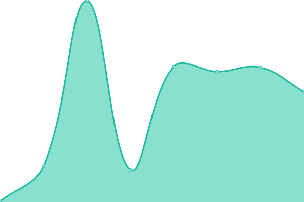
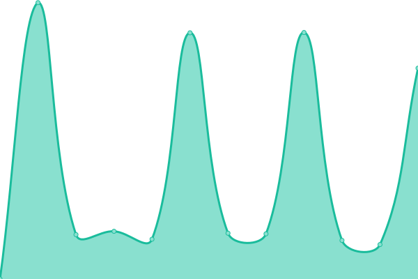
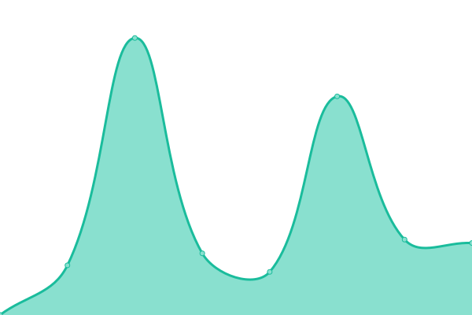
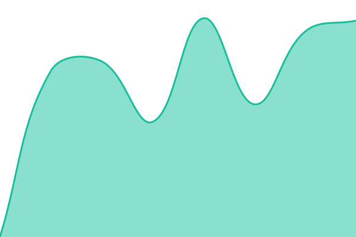

# [📈 Live Status](https://status.cachyos.org): <!--live status--> **🟧 Partial outage**

This repository contains the open-source uptime monitor and status page for [CachyOS](https://cachyos.org), powered by [Upptime](https://github.com/upptime/upptime).

With [Upptime](https://upptime.js.org), you can get your own unlimited and free uptime monitor and status page, powered entirely by a GitHub repository. We use [Issues](https://github.com/CachyOS/statuspage/issues) as incident reports, [Actions](https://github.com/CachyOS/statuspage/actions) as uptime monitors, and [Pages](https://status.cachyos.org) for the status page.

<!--start: status pages-->
<!-- This summary is generated by Upptime (https://github.com/upptime/upptime) -->
<!-- Do not edit this manually, your changes will be overwritten -->
<!-- prettier-ignore -->
| URL | Status | History | Response Time | Uptime |
| --- | ------ | ------- | ------------- | ------ |
|  [Website](https://cachyos.org/) | 🟩 Up | [website.yml](https://github.com/CachyOS/statuspage/commits/HEAD/history/website.yml) | 

 614ms
     
 | 

<a href="https://status.cachyos.org/history/website">100.00%</a>
    

|  [Tebi CDN (USA, Germany, Singapore)](https://cdn-1.cachyos.org/x86_64/cachyos/cachyos.db) | 🟩 Up | [tebi-cdn-usa-germany-singapore.yml](https://github.com/CachyOS/statuspage/commits/HEAD/history/tebi-cdn-usa-germany-singapore.yml) | 

 1181ms
     
 | 

<a href="https://status.cachyos.org/history/tebi-cdn-usa-germany-singapore">100.00%</a>
    

|  [CDN77 CDN (Worldwide Cache)](https://cdn77.cachyos.org/repo/x86_64/cachyos/cachyos.db) | 🟩 Up | [cdn-77-cdn-worldwide-cache.yml](https://github.com/CachyOS/statuspage/commits/HEAD/history/cdn-77-cdn-worldwide-cache.yml) | 

 153ms
     
 | 

<a href="https://status.cachyos.org/history/cdn-77-cdn-worldwide-cache">100.00%</a>
    

|  [DE mirror](https://mirror.cachyos.org/) | 🟩 Up | [de-mirror.yml](https://github.com/CachyOS/statuspage/commits/HEAD/history/de-mirror.yml) | 

 411ms
     
 | 

<a href="https://status.cachyos.org/history/de-mirror">100.00%</a>
    

|  [DE2 mirror](https://aur.cachyos.org/) | 🟩 Up | [de-2-mirror.yml](https://github.com/CachyOS/statuspage/commits/HEAD/history/de-2-mirror.yml) | 

 140ms
     
 | 

<a href="https://status.cachyos.org/history/de-2-mirror">100.00%</a>
    

|  [France mirror](https://mirror.lesviallon.fr/cachy/) | 🟩 Up | [france-mirror.yml](https://github.com/CachyOS/statuspage/commits/HEAD/history/france-mirror.yml) | 

 617ms
     
 | 

<a href="https://status.cachyos.org/history/france-mirror">100.00%</a>
    

|  [Russia mirror](https://mirror.truenetwork.ru/cachy/) | 🟩 Up | [russia-mirror.yml](https://github.com/CachyOS/statuspage/commits/HEAD/history/russia-mirror.yml) | 

 948ms
     
 | 

<a href="https://status.cachyos.org/history/russia-mirror">100.00%</a>
    

|  [USA mirror](https://us.cachyos.org/) | 🟩 Up | [usa-mirror.yml](https://github.com/CachyOS/statuspage/commits/HEAD/history/usa-mirror.yml) | 

 190ms
     
 | 

<a href="https://status.cachyos.org/history/usa-mirror">100.00%</a>
    

|  [Norway2 Mirror](https://no.mirror.cx/cachyos/) | 🟩 Up | [norway2-mirror.yml](https://github.com/CachyOS/statuspage/commits/HEAD/history/norway2-mirror.yml) | 

 681ms
     
 | 

<a href="https://status.cachyos.org/history/norway2-mirror">100.00%</a>
    

|  [Austria Mirror](https://at.cachyos.org) | 🟥 Down | [austria-mirror.yml](https://github.com/CachyOS/statuspage/commits/HEAD/history/austria-mirror.yml) | 

 135ms
     
 | 

<a href="https://status.cachyos.org/history/austria-mirror">100.00%</a>
    

|  [South Korea Mirror 2](https://mirror.funami.tech/cachy/) | 🟥 Down | [south-korea-mirror-2.yml](https://github.com/CachyOS/statuspage/commits/HEAD/history/south-korea-mirror-2.yml) | 

 925ms
     
 | 

<a href="https://status.cachyos.org/history/south-korea-mirror-2">99.99%</a>
    

|  [China Mirror 20GBs](https://mirrors.tuna.tsinghua.edu.cn/cachyos/) | 🟥 Down | [china-mirror-20-g-bs.yml](https://github.com/CachyOS/statuspage/commits/HEAD/history/china-mirror-20-g-bs.yml) | 

 1902ms
     
 | 

<a href="https://status.cachyos.org/history/china-mirror-20-g-bs">0.00%</a>
    

<!--end: status pages-->

[**Visit our status website →**](https://status.cachyos.org)

## 📄 License

- Powered by: [Upptime](https://github.com/upptime/upptime)
- Code: [MIT](./LICENSE) © [CachyOS](https://cachyos.org)
- Data in the `./history` directory: [Open Database License](https://opendatacommons.org/licenses/odbl/1-0/)
