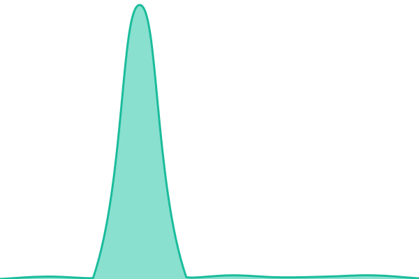
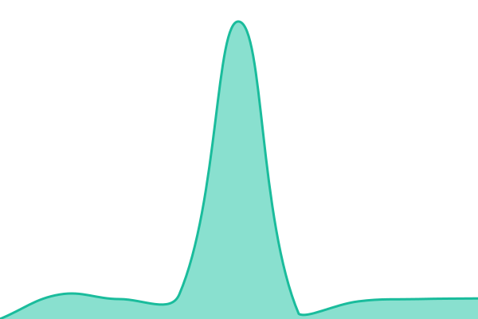
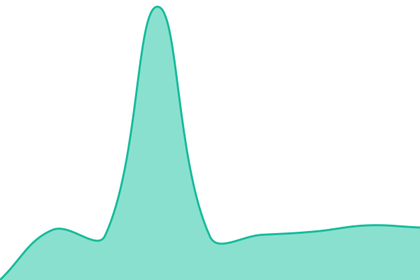
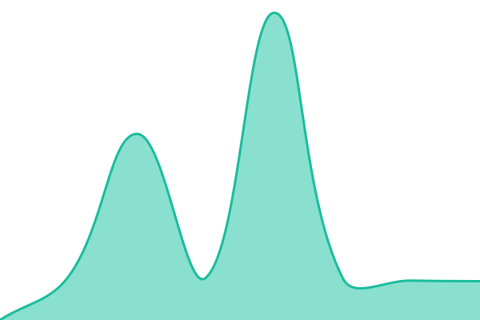
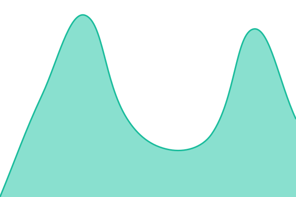
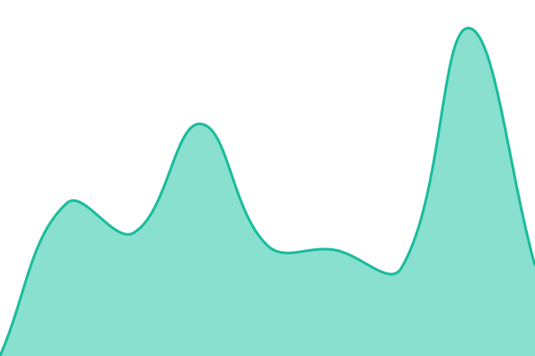
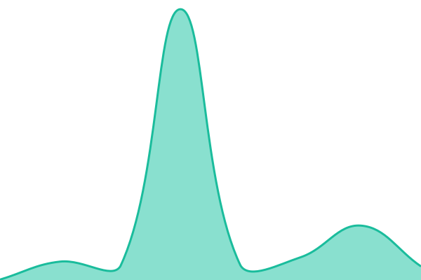

# [📈 Live Status](https://status.cachyos.org): <!--live status--> **🟧 Partial outage**

This repository contains the open-source uptime monitor and status page for [CachyOS](https://cachyos.org), powered by [Upptime](https://github.com/upptime/upptime).

With [Upptime](https://upptime.js.org), you can get your own unlimited and free uptime monitor and status page, powered entirely by a GitHub repository. We use [Issues](https://github.com/CachyOS/statuspage/issues) as incident reports, [Actions](https://github.com/CachyOS/statuspage/actions) as uptime monitors, and [Pages](https://status.cachyos.org) for the status page.

<!--start: status pages-->
<!-- This summary is generated by Upptime (https://github.com/upptime/upptime) -->
<!-- Do not edit this manually, your changes will be overwritten -->
<!-- prettier-ignore -->
| URL | Status | History | Response Time | Uptime |
| --- | ------ | ------- | ------------- | ------ |
|  [Website](https://cachyos.org/) | 🟩 Up | [website.yml](https://github.com/CachyOS/statuspage/commits/HEAD/history/website.yml) | 

 702ms
     
 | 

<a href="https://status.cachyos.org/history/website">100.00%</a>
    

|  [Wiki](https://wiki.cachyos.org/) | 🟩 Up | [wiki.yml](https://github.com/CachyOS/statuspage/commits/HEAD/history/wiki.yml) | 

 229ms
     
 | 

<a href="https://status.cachyos.org/history/wiki">100.00%</a>
    

|  [Discuss](https://discuss.cachyos.org/) | 🟩 Up | [discuss.yml](https://github.com/CachyOS/statuspage/commits/HEAD/history/discuss.yml) | 

 403ms
     
 | 

<a href="https://status.cachyos.org/history/discuss">100.00%</a>
    

|  [CDN77 CDN (Worldwide)](https://cdn77.cachyos.org/repo/x86_64/cachyos/cachyos.db) | 🟩 Up | [cdn-77-cdn-worldwide.yml](https://github.com/CachyOS/statuspage/commits/HEAD/history/cdn-77-cdn-worldwide.yml) | 

 250ms
     
 | 

<a href="https://status.cachyos.org/history/cdn-77-cdn-worldwide">100.00%</a>
    

|  [USA Mirror](https://us.cachyos.org/) | 🟩 Up | [usa-mirror.yml](https://github.com/CachyOS/statuspage/commits/HEAD/history/usa-mirror.yml) | 

 331ms
     
 | 

<a href="https://status.cachyos.org/history/usa-mirror">100.00%</a>
    

|  [USA Mirror (Minnesota)](https://us-mnz.soulharsh007.dev/cachyos/) | 🟩 Up | [usa-mirror-minnesota.yml](https://github.com/CachyOS/statuspage/commits/HEAD/history/usa-mirror-minnesota.yml) | 

 4170ms
     
 | 

<a href="https://status.cachyos.org/history/usa-mirror-minnesota">98.67%</a>
    

|  [USA Mirror (Michigan)](https://mirrors.lansing2600.org/cachyos/) | 🟩 Up | [usa-mirror-michigan.yml](https://github.com/CachyOS/statuspage/commits/HEAD/history/usa-mirror-michigan.yml) | 

 281ms
     
 | 

<a href="https://status.cachyos.org/history/usa-mirror-michigan">98.76%</a>
    

|  [USA CDN (Michigan)](https://cdn.lansing2600.org/cachyos/) | 🟩 Up | [usa-cdn-michigan.yml](https://github.com/CachyOS/statuspage/commits/HEAD/history/usa-cdn-michigan.yml) | 

 325ms
     
 | 

<a href="https://status.cachyos.org/history/usa-cdn-michigan">100.00%</a>
    

|  [USA Mirror (Las Vegas)](https://mirror.hjk.gg/cachyos/) | 🟥 Down | [usa-mirror-las-vegas.yml](https://github.com/CachyOS/statuspage/commits/HEAD/history/usa-mirror-las-vegas.yml) | 

 1181ms
     
 | 

<a href="https://status.cachyos.org/history/usa-mirror-las-vegas">0.00%</a>
    

|  [USA Mirror (UMBC)](https://mirror.lug.umbc.edu/cachyos/) | 🟩 Up | [usa-mirror-umbc.yml](https://github.com/CachyOS/statuspage/commits/HEAD/history/usa-mirror-umbc.yml) | 

 365ms
     
 | 

<a href="https://status.cachyos.org/history/usa-mirror-umbc">100.00%</a>
    

|  [Canada Mirror](https://ca.mirror.cx/cachyos/) | 🟩 Up | [canada-mirror.yml](https://github.com/CachyOS/statuspage/commits/HEAD/history/canada-mirror.yml) | 

 662ms
     
 | 

<a href="https://status.cachyos.org/history/canada-mirror">100.00%</a>
    

|  [France Mirror](https://mirror.lesviallon.fr/cachy/) | 🟩 Up | [france-mirror.yml](https://github.com/CachyOS/statuspage/commits/HEAD/history/france-mirror.yml) | 

 612ms
     
 | 

<a href="https://status.cachyos.org/history/france-mirror">100.00%</a>
    

|  [Austria Mirror](https://at.cachyos.org) | 🟩 Up | [austria-mirror.yml](https://github.com/CachyOS/statuspage/commits/HEAD/history/austria-mirror.yml) | 

 694ms
     
 | 

<a href="https://status.cachyos.org/history/austria-mirror">100.00%</a>
    

|  [Germany Mirror](https://mirror.mergedcloud.de/cachyos/) | 🟥 Down | [germany-mirror.yml](https://github.com/CachyOS/statuspage/commits/HEAD/history/germany-mirror.yml) | 

 0ms
     
 | 

<a href="https://status.cachyos.org/history/germany-mirror">0.00%</a>
    

|  [Netherlands Mirror](https://nl.mirror.cx/cachyos/) | 🟩 Up | [netherlands-mirror.yml](https://github.com/CachyOS/statuspage/commits/HEAD/history/netherlands-mirror.yml) | 

 744ms
     
 | 

<a href="https://status.cachyos.org/history/netherlands-mirror">100.00%</a>
    

|  [Sweden Mirror](https://mirror.zyner.org/cachyos/) | 🟩 Up | [sweden-mirror.yml](https://github.com/CachyOS/statuspage/commits/HEAD/history/sweden-mirror.yml) | 

 559ms
     
 | 

<a href="https://status.cachyos.org/history/sweden-mirror">100.00%</a>
    

|  [Switzerland Mirror](https://mirror.hb9hil.org/cachyos/) | 🟩 Up | [switzerland-mirror.yml](https://github.com/CachyOS/statuspage/commits/HEAD/history/switzerland-mirror.yml) | 

 901ms
     
 | 

<a href="https://status.cachyos.org/history/switzerland-mirror">100.00%</a>
    

|  [Switzerland Mirror (init7)](https://mirror.init7.net/cachyos/) | 🟩 Up | [switzerland-mirror-init7.yml](https://github.com/CachyOS/statuspage/commits/HEAD/history/switzerland-mirror-init7.yml) | 

 590ms
     
 | 

<a href="https://status.cachyos.org/history/switzerland-mirror-init7">100.00%</a>
    

|  [Norway Mirror](https://no.mirror.cx/cachyos/) | 🟩 Up | [norway-mirror.yml](https://github.com/CachyOS/statuspage/commits/HEAD/history/norway-mirror.yml) | 

 784ms
     
 | 

<a href="https://status.cachyos.org/history/norway-mirror">100.00%</a>
    

|  [Italy Mirror (NextWorks)](https://cachyos.next-works.it/) | 🟩 Up | [italy-mirror-next-works.yml](https://github.com/CachyOS/statuspage/commits/HEAD/history/italy-mirror-next-works.yml) | 

 845ms
     
 | 

<a href="https://status.cachyos.org/history/italy-mirror-next-works">100.00%</a>
    

|  [Italy Mirror (m1k.cloud)](https://cachyos-mirror.m1k.cloud/) | 🟩 Up | [italy-mirror-m1k-cloud.yml](https://github.com/CachyOS/statuspage/commits/HEAD/history/italy-mirror-m1k-cloud.yml) | 

 530ms
     
 | 

<a href="https://status.cachyos.org/history/italy-mirror-m1k-cloud">100.00%</a>
    

|  [Finland Mirror](https://cachyos.doridian.net/) | 🟥 Down | [finland-mirror.yml](https://github.com/CachyOS/statuspage/commits/HEAD/history/finland-mirror.yml) | 

 186ms
     
 | 

<a href="https://status.cachyos.org/history/finland-mirror">98.98%</a>
    

|  [Hungary Mirror](https://mirror.bali0531.hu/) | 🟩 Up | [hungary-mirror.yml](https://github.com/CachyOS/statuspage/commits/HEAD/history/hungary-mirror.yml) | 

 565ms
     
 | 

<a href="https://status.cachyos.org/history/hungary-mirror">100.00%</a>
    

|  [UK Mirror](https://repo.c48.uk/cachyos/) | 🟩 Up | [uk-mirror.yml](https://github.com/CachyOS/statuspage/commits/HEAD/history/uk-mirror.yml) | 

 500ms
     
 | 

<a href="https://status.cachyos.org/history/uk-mirror">100.00%</a>
    

|  [Bangladesh Mirror](https://mirror.limda.net/cachy/) | 🟩 Up | [bangladesh-mirror.yml](https://github.com/CachyOS/statuspage/commits/HEAD/history/bangladesh-mirror.yml) | 

 1042ms
     
 | 

<a href="https://status.cachyos.org/history/bangladesh-mirror">100.00%</a>
    

|  [India Mirror](https://cachyos.mirror.sahil.world/) | 🟩 Up | [india-mirror.yml](https://github.com/CachyOS/statuspage/commits/HEAD/history/india-mirror.yml) | 

 1255ms
     
 | 

<a href="https://status.cachyos.org/history/india-mirror">97.89%</a>
    

|  [Russia Mirror (archlinux.gay)](https://archlinux.gay/cachy/) | 🟩 Up | [russia-mirror-archlinux-gay.yml](https://github.com/CachyOS/statuspage/commits/HEAD/history/russia-mirror-archlinux-gay.yml) | 

 723ms
     
 | 

<a href="https://status.cachyos.org/history/russia-mirror-archlinux-gay">100.00%</a>
    

|  [Russia Mirror (jura12)](https://mirror.jura12.ru/) | 🟩 Up | [russia-mirror-jura12.yml](https://github.com/CachyOS/statuspage/commits/HEAD/history/russia-mirror-jura12.yml) | 

 808ms
     
 | 

<a href="https://status.cachyos.org/history/russia-mirror-jura12">97.32%</a>
    

|  [Russia Mirror (cachy-arch.ru)](https://mirror.cachy-arch.ru/cachyos/) | 🟩 Up | [russia-mirror-cachy-arch-ru.yml](https://github.com/CachyOS/statuspage/commits/HEAD/history/russia-mirror-cachy-arch-ru.yml) | 

 766ms
     
 | 

<a href="https://status.cachyos.org/history/russia-mirror-cachy-arch-ru">100.00%</a>
    

|  [Russia Mirror (metrosg.ru)](https://wan.metrosg.ru/cachyos/) | 🟥 Down | [russia-mirror-metrosg-ru.yml](https://github.com/CachyOS/statuspage/commits/HEAD/history/russia-mirror-metrosg-ru.yml) | 

 933ms
     
 | 

<a href="https://status.cachyos.org/history/russia-mirror-metrosg-ru">0.00%</a>
    

|  [China Mirror (Nanjing)](https://mirror.nju.edu.cn/cachyos/) | 🟩 Up | [china-mirror-nanjing.yml](https://github.com/CachyOS/statuspage/commits/HEAD/history/china-mirror-nanjing.yml) | 

 1889ms
     
 | 

<a href="https://status.cachyos.org/history/china-mirror-nanjing">95.89%</a>
    

|  [China Mirror (USTC)](https://mirrors.ustc.edu.cn/cachyos/) | 🟩 Up | [china-mirror-ustc.yml](https://github.com/CachyOS/statuspage/commits/HEAD/history/china-mirror-ustc.yml) | 

 1495ms
     
 | 

<a href="https://status.cachyos.org/history/china-mirror-ustc">100.00%</a>
    

|  [South Korea Mirror (Keiverse)](https://mirror.keiminem.com/cachyos/) | 🟩 Up | [south-korea-mirror-keiverse.yml](https://github.com/CachyOS/statuspage/commits/HEAD/history/south-korea-mirror-keiverse.yml) | 

 561ms
     
 | 

<a href="https://status.cachyos.org/history/south-korea-mirror-keiverse">100.00%</a>
    

|  [South Korea Mirror (Keiverse 2)](https://mirror2.keiminem.com/cachyos/) | 🟩 Up | [south-korea-mirror-keiverse-2.yml](https://github.com/CachyOS/statuspage/commits/HEAD/history/south-korea-mirror-keiverse-2.yml) | 

 4467ms
     
 | 

<a href="https://status.cachyos.org/history/south-korea-mirror-keiverse-2">98.02%</a>
    

|  [South Korea Mirror (KRFOSS)](https://mirror.krfoss.org/cachyos/) | 🟥 Down | [south-korea-mirror-krfoss.yml](https://github.com/CachyOS/statuspage/commits/HEAD/history/south-korea-mirror-krfoss.yml) | 

 143ms
     
 | 

<a href="https://status.cachyos.org/history/south-korea-mirror-krfoss">0.00%</a>
    

|  [South Korea Mirror (KRFOSS 5)](https://mirror5.krfoss.org/cachyos/repo/x86_64/cachyos/cachyos.db) | 🟩 Up | [south-korea-mirror-krfoss-5.yml](https://github.com/CachyOS/statuspage/commits/HEAD/history/south-korea-mirror-krfoss-5.yml) | 

 236ms
     
 | 

<a href="https://status.cachyos.org/history/south-korea-mirror-krfoss-5">100.00%</a>
    

|  [Vietnam Mirror](https://mirrors.nguyenhoang.cloud/cachyos/) | 🟩 Up | [vietnam-mirror.yml](https://github.com/CachyOS/statuspage/commits/HEAD/history/vietnam-mirror.yml) | 

 1235ms
     
 | 

<a href="https://status.cachyos.org/history/vietnam-mirror">100.00%</a>
    

<!--end: status pages-->

[**Visit our status website →**](https://status.cachyos.org)

## 📄 License

- Powered by: [Upptime](https://github.com/upptime/upptime)
- Code: [MIT](./LICENSE) © [CachyOS](https://cachyos.org)
- Data in the `./history` directory: [Open Database License](https://opendatacommons.org/licenses/odbl/1-0/)
